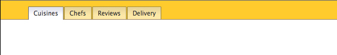

# IV - NavBar Homework

## Homework Review - A Single Page Application (SPA)



The homework is finished in `final.html` in the`app/done` folder.

Examine `index-flex.html` in the `done` folder. Note the use of page fragments links. Note the problems with refresh (bookmarking etc.).

## REVIEW

In `app/cuisines.html` change the CSS selector to reference an active class and add that class to the HTML for the cuisines link, e.g.:

```html
<li class="t-cuisines"><a class="active" href="cuisines.html">Cuisines</a></li>
```

and:

```css
a:hover,
a.active {
	border-bottom: none;
	background-image: linear-gradient(
		to bottom,
		rgba(255, 255, 255, 1) 0%,
		rgba(224, 226, 240, 1) 6%,
		rgba(254, 254, 254, 1) 53%
	);
}
```

Create a script and add:

```js
	var tabs = document.querySelector('#nav a');
	console.log(tabs);
```

This selects only the first tab. We need to use `querySelectorAll` because we are gathering more than one item:

```js
var tabs = document.querySelectorAll('#nav a');
console.log(tabs);
```

Examine the nodelist in the inspector. Not that it has a method `forEach`.

```js
var tabs = document.querySelectorAll('#nav a');
tabs.forEach(function(tab) {
	console.log(tab);
});
```

We will attach an eventListener to each of the tabs using `forEach`:

```js
var tabs = document.querySelectorAll('#nav a');
tabs.forEach(function(tab) {
	tab.addEventListener('click', makeActive);
});

function makeActive() {
	console.log(this);
	event.preventDefault();
}
```

Using an Arrow function shortcut (for anonymous functions):

```js
var tabs = document.querySelectorAll('#nav a');
tabs.forEach(tab => tab.addEventListener('click', makeActive));

function makeActive() {
	console.log(this);
	event.preventDefault();
}
```

Note the use of `this` to refer to the thing clicked on. The value of `this` is determined by a functions' execution context. Execution context simply means how a function is called. Our function is called by clicking on a link so `this` shows as a link in the console when we log it.

Let's use `classList` again to add a class to the link we click on:

```js
var tabs = document.querySelectorAll('#nav a');
tabs.forEach(tab => tab.addEventListener('click', makeActive));

function makeActive() {
	this.classList.add('active');
	event.preventDefault();
}
```

Lets remove the class from all tabs before we add it so that only one is active at a time:

```js
var tabs = document.querySelectorAll('#nav a');
tabs.forEach(tab => tab.addEventListener('click', makeActive));

function makeActive() {
	tabs.forEach(tab => tab.classList.remove('active'));
	this.classList.add('active');
	event.preventDefault();
}
```

We can separate the removal out into its own function and then call that function (`makeInactive();`):

```js
var tabs = document.querySelectorAll('#nav a');
tabs.forEach(tab => tab.addEventListener('click', makeActive));

function makeActive() {
	makeInactive();
	this.classList.add('active');
	event.preventDefault();
}

function makeInactive() {
	tabs.forEach(tab => tab.classList.remove('active'));
}
```

Add some variables with content. It is usually a good idea to declare your variables at the top of the script so that they are available to the code that comes after.

```js
var cuisines =
	'Cuisines. Lorem ipsum dolor sit amet, consectetur adipisicing elit. Distinctio maiores adipisci quibusdam repudiandae dolor vero placeat esse sit! Quibusdam saepe aperiam explicabo placeat optio, consequuntur nihil voluptatibus expedita quia vero perferendis, deserunt et incidunt eveniet temporibus doloremque possimus facilis.';

var chefs =
	'Chefs. Possimus labore, officia dolore! Eaque ratione saepe, alias harum laboriosam deserunt laudantium blanditiis eum explicabo placeat reiciendis labore iste sint. Consectetur expedita dignissimos, non quos distinctio, eos rerum facilis eligendi.';

var reviews =
	'Reviews. Asperiores laudantium, rerum ratione consequatur, culpa consectetur possimus atque ab tempore illum non dolor nesciunt. Neque, rerum. A vel non incidunt, quod doloremque dignissimos necessitatibus aliquid laboriosam architecto at cupiditate commodi expedita in, quae blanditiis.';

var delivery =
	'Delivery. Possimus labore, officia dolore! Eaque ratione saepe, alias harum laboriosam deserunt laudantium blanditiis eum explicabo placeat reiciendis labore iste sint. Consectetur expedita dignissimos, non quos distinctio, eos rerum facilis eligendi.';
```

Create an empty `div` with a class of `content` in the html:

```html
<div class="content"></div>
```

Create a reference to it and initialize our page with some text using `innerHTML`:

```js
var contentPara = document.querySelector('.content');
contentPara.innerHTML = cuisines;
```

Note: we could use `textContent` instead of `innerHTML`.

## TODO

Style it using CSS:

```css
.content {
	padding: 1rem;
}
```

Note that we can access the value of the link's href by using `this.href`:

```js
function makeActive() {
	console.log(this.href)
	...
}
```

So let's make the text in the `.content` div change depending on the link's href using [if](https://www.w3schools.com/js/js_if_else.asp) statements. 

We will use `includes` because a test for simple equality will fail:

```js
function makeActive() {
	console.log(this.href);
	makeInactive();
	this.classList.add('active');

	// this is the new part
	if (this.href.includes('cuisines')) {
		contentPara.innerHTML = cuisines;
	} else if (this.href.includes('chefs')) {
		contentPara.innerHTML = chefs;
	} else if (this.href.includes('reviews')) {
		contentPara.innerHTML = reviews;
	} else if (this.href.includes('delivery')) {
		contentPara.innerHTML = delivery;
	}
	// end new part

	event.preventDefault();
}
```

Here is the entire final script:

```js
var cuisines =
	'Cuisines. Lorem ipsum dolor sit amet, consectetur adipisicing elit. Distinctio maiores adipisci quibusdam repudiandae dolor vero placeat esse sit! Quibusdam saepe aperiam explicabo placeat optio, consequuntur nihil voluptatibus expedita quia vero perferendis, deserunt et incidunt eveniet temporibus doloremque possimus facilis.';

var chefs =
	'Chefs. Possimus labore, officia dolore! Eaque ratione saepe, alias harum laboriosam deserunt laudantium blanditiis eum explicabo placeat reiciendis labore iste sint. Consectetur expedita dignissimos, non quos distinctio, eos rerum facilis eligendi.';

var reviews =
	'Reviews. Asperiores laudantium, rerum ratione consequatur, culpa consectetur possimus atque ab tempore illum non dolor nesciunt. Neque, rerum. A vel non incidunt, quod doloremque dignissimos necessitatibus aliquid laboriosam architecto at cupiditate commodi expedita in, quae blanditiis.';

var delivery =
	'Delivery. Possimus labore, officia dolore! Eaque ratione saepe, alias harum laboriosam deserunt laudantium blanditiis eum explicabo placeat reiciendis labore iste sint. Consectetur expedita dignissimos, non quos distinctio, eos rerum facilis eligendi.';

var contentPara = document.querySelector('.content');
contentPara.innerHTML = cuisines;

var tabs = document.querySelectorAll('#nav a');
tabs.forEach(tab => tab.addEventListener('click', makeActive));

function makeActive() {
	console.log(this.href);
	makeInactive();
	this.classList.add('active');

	// this is the new part
	if (this.href.includes('cuisines')) {
		contentPara.innerHTML = cuisines;
	} else if (this.href.includes('chefs')) {
		contentPara.innerHTML = chefs;
	} else if (this.href.includes('reviews')) {
		contentPara.innerHTML = reviews;
	} else if (this.href.includes('delivery')) {
		contentPara.innerHTML = delivery;
	}
	// end new part

	event.preventDefault();
}

function makeInactive() {
	tabs.forEach(tab => tab.classList.remove('active'));
}
```

In JavaScript parlance this is something akin to what is known as `routing`, but its not quite there yet.

One of the big problems with what we've built might be termed _maintaining state_. If you refresh the browser while you are on the Reviews tab it reinitializes the page to show the Cuisines tab.

To correct this we need to change the URL shown in the address bar of the browser to something unique. We would then use that information to make sure the appropriate content is shown.


## FlexBox

* CSS Flexible Box Layout Module
* A simple guide to the various CSS properties on [CSS Tricks](https://css-tricks.com/snippets/css/a-guide-to-flexbox/)
* Try https://www.w3schools.com/css/css3_flexbox.asp

FlexBox:

* CSS Flexible Box Layout Module
* A simple guide to the various CSS properties on [CSS Tricks](https://css-tricks.com/snippets/css/a-guide-to-flexbox/)

We will use [Font Awesome](http://fontawesome.io/) for the icons in this exercise.

In `index.html`:

```
<link rel="stylesheet" href="css/font-awesome-4.6.3/css/font-awesome.min.css">
```

For the logo:

```html
<a href="#0" class="logo"><i class="fa fa-bullseye fa-3x"></i></a>
```

Gear:

```html
<i class="fa fa-gear"></i>
```

A font stack that ensures the [device's default font](https://www.smashingmagazine.com/2015/11/using-system-ui-fonts-practical-guide/) will be used (native font):

```css
body {
  font-family: -apple-system, BlinkMacSystemFont, "Segoe UI", Roboto, Helvetica, Arial, sans-serif;
}
```

```css
a {
color: #fff;
text-decoration: none;
}

header {
  background: #0D1313;
  color: #fff;
  display: flex;
  align-items: center;
  padding:0.5rem;
}
```

Hide the account dropdown:

```css
.account-dropdown ul {
    display: none;
}
```

Format the logo:

```css
.logo {
  text-decoration: none;
  color: white;
  padding: 10px;
}
```

Format the unordered list and links:

```css
.site-nav ul {
  list-style: none;
  display: flex;
  margin: 0;
  padding: 0;
}

.site-nav  a {
  text-transform: uppercase;
  text-decoration: none;
  color: #CDD0D0;
  padding: 20px;
  display: inline-block;
}
```

Set up an active state:

```css
.site-nav .active a {
  font-weight: bold;
  color: #62DEBE;
  background: #444;
}
```

Note the margin left auto setting for the actions section:

```css
.account-actions {
  margin-left: auto;
  display: flex;
  align-items: center;
  margin-right: 10px;
}

.sign-out-link {
  color: #62DEBE;
  font-size: 0.8rem;
  margin-left: 10px;
  text-transform: uppercase;
  text-decoration: none;
}
```

Add [the responsive meta tag](https://css-tricks.com/snippets/html/responsive-meta-tag/):

```html
<meta name="viewport" content="width=device-width">
```

In a media query, turn wrapping on and set the order of the site nav to second place to improve the layout:

```css
@media (max-width: 600px) {
  header {
    flex-wrap: wrap;
  }
  .site-nav {
    order: 2;
    background: #333;
    width: 100%;
  }
}
```

<!-- Refactor CSS for `text-decoration`, `text-transform` ... -->

### Interactivity

See `index-done.html` for a demo.

Part ONE - get the gear icon to expose the options

```js

var gear = document.querySelector('.fa-gear')
var options = document.querySelector('.account-dropdown ul')

gear.addEventListener('click', showOptions)

function showOptions(){
  options.classList.toggle('active')
}
```

Note - requires corresponding CSS (see `index-done.html`)

```css
.active {
  display: flex !important;
}

.account-dropdown {
  position: relative;
  display: flex;
}

.account-dropdown ul {
  padding: 4px;
  margin: 0;
  list-style: none;
  position: absolute;
  top: 20px; 
  left: 10px;
  color: #333;
  background: #fff;
  font-size: 0.875rem;
}
```

Add an active class to the navigation.

Introduces for loops and 'this' 

```js

var mainNav = document.querySelectorAll('.site-nav li')

for ( var i = 0; i < mainNav.length; i++){
  mainNav[i].addEventListener('click', setActive)
}

function setActive(){
  for ( var i = 0; i < mainNav.length; i++){
    mainNav[i].classList.remove('active')
  }
  this.classList.add('active')
  event.preventDefault()
}
```

## Notes

`"start": "browser-sync start  --server --watch"`

